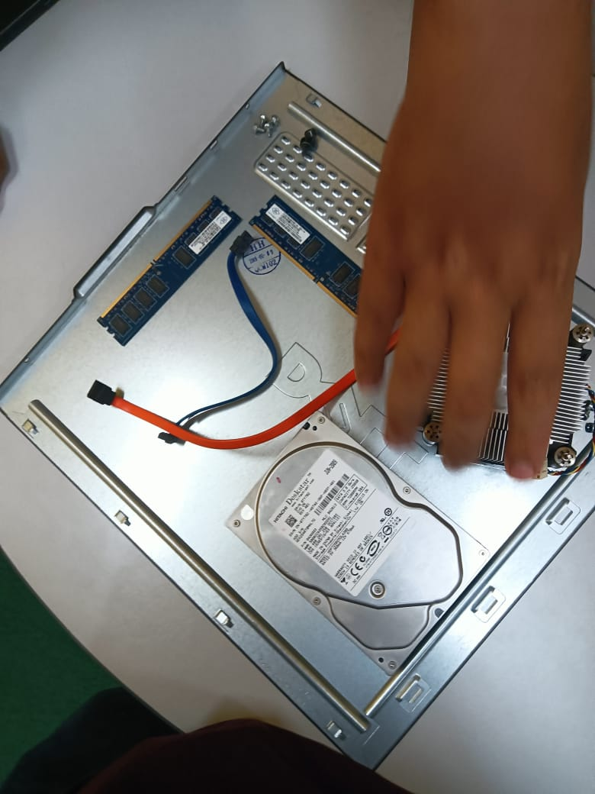

# Technology and Information Systems (SECP1513) - E-Portfolio

**Name:** Mashrur Rahman
**Student ID:** [A23CS4038]
**Section:** [08]
**Degree:** Bachelor of Computer Science (Software Engineering)
**Faculty:** Faculty of Computing, Universiti Teknologi Malaysia

---

## 1.0 Industry Talk & Visit
**Activity:** Industry visit to UTM digital
**Date:** [28/10/25]

### Artifact
* [📄 View Visit Report (PDF)](Industry_talk_Report.pdf)
* [🎥 Watch Interview Video](Interview_Video.mp4)
* [industry talk 2 ppg poster](ppg_poster.pdf)
* [industry talk 3 air asia and clarity techworks](air_asia_and_clarity_tech_works_poster.pdf)

### Reflection
* **What I Gained:** in that industry talk we listened to the representatives from microsoft, we learned about copilot . and also learned how  a it industry like UTM digital run internaly.for other industry talks other than utm digital we learned how those company runs and their procedure of hiring.
* **Suggestions for Improvement:** The session was informative, but a more interactive Q&A session with the speakers would have been beneficial. Allocating more time for specific career-related questions would add value.
* **My Opinion:** The visit was good to know and interect with people of IT department.

---

## 2.0 PC Assembly (Lab)
**Date:** [11/11/2025]

### Artifacts

[pc Assembly](pc_Assembly.jpg)

### Reflection
* **What I Gained:** it literally taught me how computers are organised physically, and also we reassembled the pc
* **Suggestions for Improvement:** The experiace was good i have no extra sugession for it.
* **My Opinion:** As a software engineer, knowing the hardware constraints is crucial. This lab made me appreciate the complexity of the machines we write code for.

---

## 3.0 Design Thinking (SpaceSync Project)
**Project:** SpaceSync: Real-Time Campus Study Spot Manager
**Role:**  Report & Presentation

### Artifacts
* [📄 View Full Project Report (PDF)](Project_Report.pdf)
* [📊 View Project Presentation (video)](Project_Presentation.mp4)

### Reflection
* **What I Gained:** main task for me in this project was to collect information from the stakeholders of our system and i also collected their requirements.
* **Suggestions for Improvement:** we tried our best.
* **My Opinion:** it helped me to learn importance of our system and how people are suffering without it.
